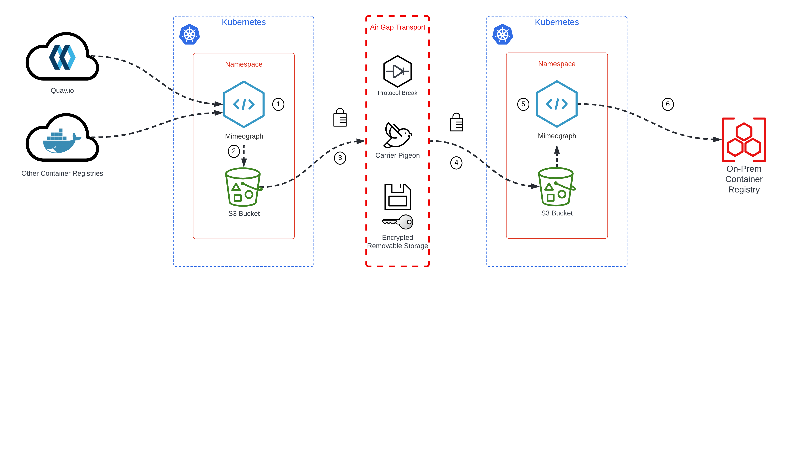

## Using Mimeograph with Kubernetes/OpenShift

Mimeograph was originally designed to help automate `oc-mirror` to make mirroring into air-gapped OpenShift environments easier to manage. `oc-mirror` already helps with this enormously, but further automation is needed to make this both more manageable and easier to keep track of upgrades of the many moving parts involved.

Once setup, Mimeograph runs as a simple k8s CronJob. Depending on configuration, this can be used to schedule a regular 'sync' of defined ImageSet(s), bundling new and updates artefacts.

### Super Simple and Contrived Example



1) Mimeograph 'bundle' job mirrors artefacts from upstream repositories
2) Mimeograph pushes bundled archive files to S3 bucket storage
3) Archive files securely transfered across the divide using some _magical technology_...
4) ...and is pushed to an on-prem S3 bucket
5) Mimeograph pulls archive files from S3 storage
6) Mimeograph 'populate' job, uploads mirrored artefacts to on-prem Container Registry

### Kustomize Manifests
A series of Kustomise manifests are provided.

Overlays are included which provision various elements (secrets, configmaps, persistent volumes, etc) for differing environments.

If using OpenShift and ODF, an Object Bucket and secret containing access credentials is automatically created for you. If using another S3 provider (eg AWS) you will need to adjust the Kustomization file to either include a secretGenerator or create a secret containing the creds to access directly.

Ensure you provide a valid `mirror-auth.json` file to consume here. This may need to include credentials for both the registry you pull from (eg `registry.redhat.io`) and the registry you will push to (eg `disconnected.registry.example.com`)

If mirroring Red Hat content for OpenShift, a pull-secret will be required. Retrieve yours from `console.redhat.com`

A default `mimeograph-config.yaml` and sample `mimeograph-imageset.yaml` file is included in each overlay. Adjust to suit your needs.

#### Base
The initial base creates core resources.

* Create a namespace (mimeograph)
* Create a ServiceAccount (mimeograph) and RoleBinding
* Creates 2x PVCs to use as persistent storage to store the Artefacts `oc-mirror` mirrors and the metadata it creates
* Creates a CronJob which runs twice a day.


#### AWS-S3 Overlay
There is an example Kustomization overlay for when using Mimeograph to send to an AWS provided S3 bucket. The Kustomization...

* Creates a ConfigMap for the Mimeograph config file - `mimeograph-config.yaml`
* Creates a ConfigMap for the `oc-mirror` ImageSetConfiguration file - `mimeograph-imageset.yaml`
* Creates a ConfigMap that contains the credentials required to access upstream and downstream registries - `config.json`
* Patches PVCs to correct StorageClass
* OPTIONALLY Creates a Secret to contain the S3 credentials for accessing the S3 Bucket

A Secret containing the correct credentials needs to be created within the namespace to allow access to the S3 bucket.

#### ODF-S3 Overlay
OpenShift Data Foundation provides an `ObjectBucketClaim` resource which acts similarly to a traditional Kubernetes PersistentVolumeClaim, but can provision on-demand S3 compatible Object Buckets in ODF. The Kustomization...

* Creates a ConfigMap for the Mimeograph config file - `mimeograph-config.yaml`
* Creates a ConfigMap for the `oc-mirror` ImageSetConfiguration file - `mimeograph-imageset.yaml`
* Creates a ConfigMap that contains the credentials required to access upstream and downstream registries - `config.json`
* Patches PVCs to correct StorageClass

When using an OBC, there is no need to create a Secret to contain the S3 credentials. A Secret which contains these credentials is automatically created by the ODF Operator upon creation, which Mimeograph can consume. 

### Usage

Depending on the target, you may need to adjust the defaults, or create an additional overlay for your environment. Review the sample overlays for inspiration.

* Ensure you have sufficient privileges within k8s/OpenShift to create all the needed resources
* Adjust an existing overlay as a starter or copy and use as a template. 
* Adjust all config files, credentials, etc to suit the environment.
* Create resources using the `oc` CLI.

```
$ oc apply -k overlays/aws-s3
```

If you wish to kick-off an ad-hoc job to test...

```
$ oc create job --from cronjob/mimeograph -n mimeograph manual-bundle-01
```
